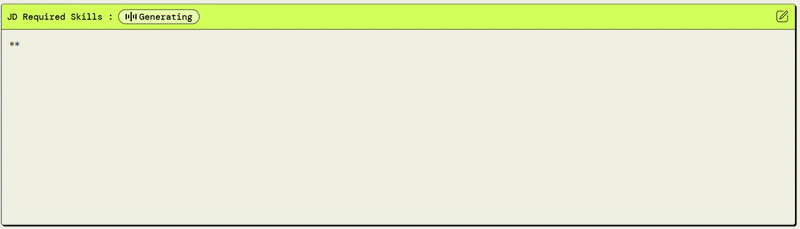
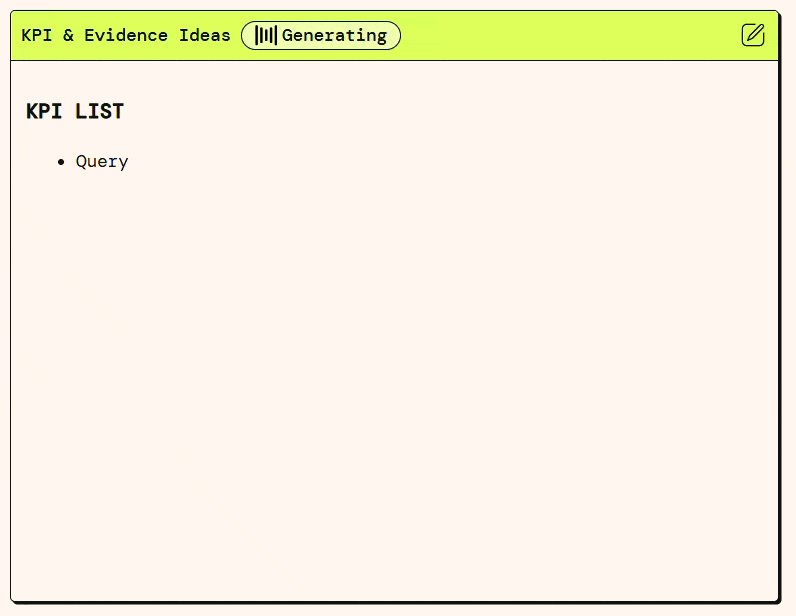
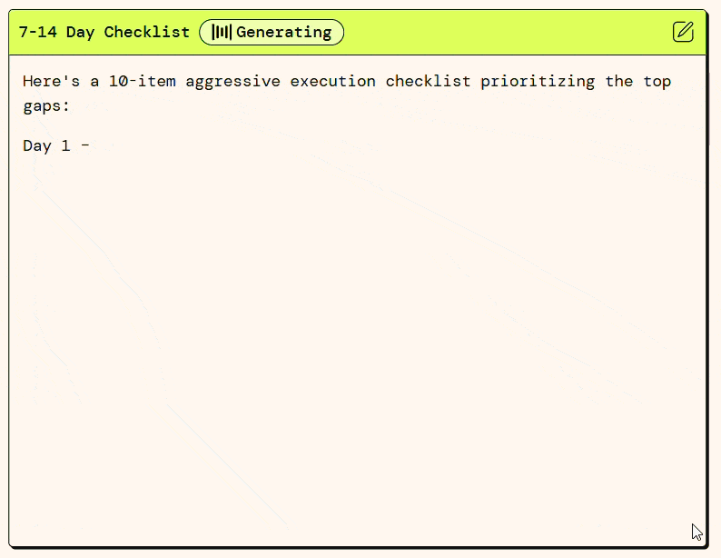

# Job Hunt Optimizer (AWS PartyRock)

Paste any Job Description (JD) and your resume, click run, and get **everything you need to tailor your application fast**:

- A **JD skill/KPI matrix** (JSON + human-readable snapshot)
- A **prioritized gap list** (what you’re missing & why it matters)
- A **fully rewritten resume** in Markdown with `[NEED METRIC]` / `[NEED DETAIL]` placeholders (no fabrication)
- **KPI & evidence ideas** (what to measure, where to pull data)
- A **14‑day action checklist** (Day 1…Day 14, each with a proof artifact)

**Live app:** https://partyrock.aws/u/dibyajyotisamal/mHu1JEpj1/Job-Hunt-Optimizer-(Upload-Resume-and-Job-Description);

---

## 1. Why this exists

Most "resume optimizers" spit out fluffy bullets and hallucinated numbers. Recruiters skim. JDs are dense. Candidates guess. This tool forces **truthful, structured, and actionable** outputs so you can update your resume and portfolio with evidence, not BS.

---

## 2. What you get (Outputs)

1. **JD Required Skills Snapshot** – Hard/soft skills, KPIs, verbs, summarized from the JD.
2. **Gap Analysis** – Top 5 gaps, redundant bullets to trim, missing metrics, and priority order.
3. **Resume Rewriter** – Complete resume in Markdown, aligned to the JD. Missing data is clearly tagged (`[NEED METRIC]`, `[NEED DETAIL]`).
4. **KPI & Evidence Ideas** – Which metrics to show, how to calculate them, and where to pull proof.
5. **14‑Day Action Checklist** – Concrete tasks with Day labels and proof artifacts.
6. **(Optional) JSON Export** – One bundle containing all sections for future automation.

---

## 3. How to use

1. **Paste JD** into *Job Description*.
2. **Paste your current resume** (full text or bullets) into *Your Resume*.
3. Choose **Tone** (and Role Level if shown). Toggle **Return JSON Too?** if you want machine-readable output.
4. Click **Run All** (or run blocks top → bottom).
5. Read outputs in this order:
   1. **JD Required Skills (Snapshot)**
   2. **Gap Analysis**
   3. **Resume Rewriter** (replace placeholders with real numbers/details)
   4. **KPI & Evidence Ideas**
   5. **14‑Day Checklist**
   6. **JSON Export** (only if toggle is ON)

> **Truth rule:** Never invent achievements. Either supply the real number or cut the claim.

---

## 4. Tech stack / How it’s built

- **AWS PartyRock** (on top of Amazon Bedrock foundation models)
- Prompt engineering with strict schemas (JSON / Markdown)
- Modular block design: JD parse → gap analysis → resume rewrite → KPI ideas → checklist
- Optional JSON export for future programmatic use

---

## 5. Screenshots / Demo

Embed a couple of screenshots or a short GIF.

```






```

---

## 6. Sample runs

See `sample_runs/` for full input/output transcripts:

- `swiggy_da_input_output.md`
- `marketing_analyst_input_output.md`

---

## 7. Roadmap / Backlog

- ATS keyword density scoring
- Multi-JD comparer (find common denominators across roles)
- Interview question generator from JD gaps
- Export to Markdown/PDF directly
- API hook / script to auto-update a resume template


---

## 8. Truth & ethics

This tool deliberately uses `[NEED METRIC]` / `[NEED DETAIL]` tags to prevent fabricated numbers. Replace them with real data or remove the claim. Lying on resumes is grounds for rejection.

---

## 9. Contributing / Forking

Feel free to fork and adapt. If you improve prompts or add new blocks, open a PR or drop an issue.

---

## 10. License

MIT License – see `LICENSE`.

---

